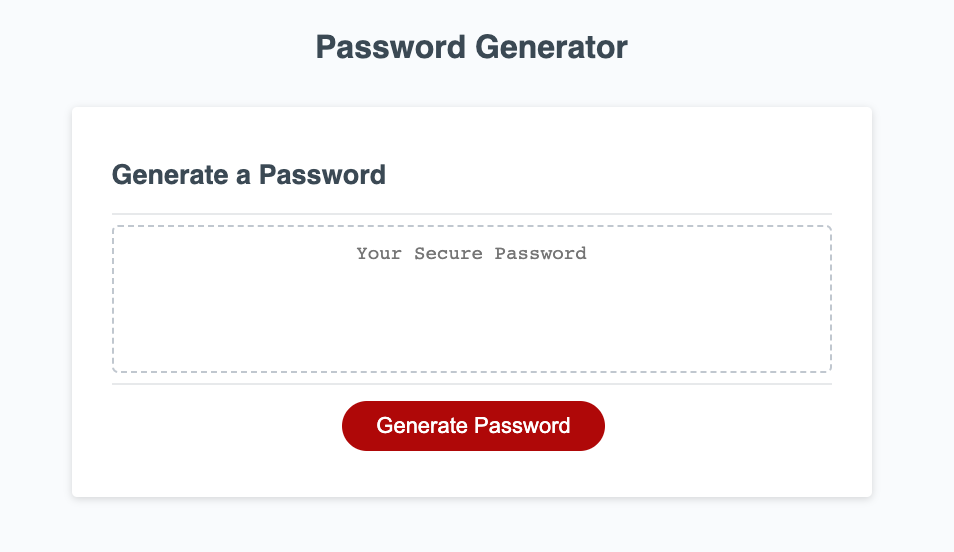

# Password-Generator
Bootcamp Challenge 3

## My Task

I modified starter code to enable random password generation. The random password includes special characters, numbers, lower case characters, and upper case characters. The end user can decide whether they want to include all of the aforementioned character types or just a few of them. 

I did this by using arrays to define global variables. Then I stored the user information in a function. I then nested that function within another function that selected random characters based on the user stored information. This was then presented in an html element using a button and event listener tool.

## Preview

The following image shows the web application's appearance and functionality:

## Links

https://github.com/ndifiori/Password-Generator

https://ndifiori.github.io/Password-Generator/

